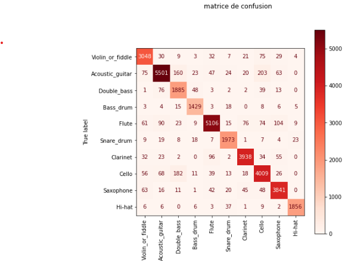
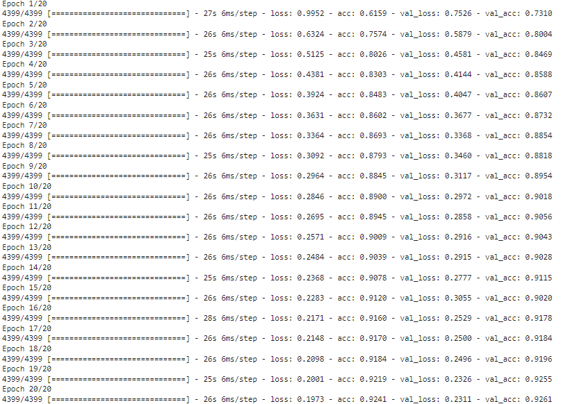
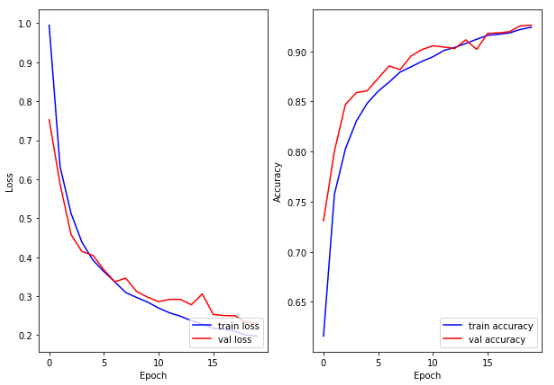

# instruments classification 
The objective of this project is to develop a real-time musical instrument recognition system that will accurately identify the different instruments present in the sound signal. To achieve this, we designed a feature extraction system and built a labeled database containing 0.1 s audio sequences. We then trained and compared two convolutional neural network (CNN) and long-term memory (LSTM) models for audio classification. Finally, we developed a Streamlit application for real-time audio analysis.

## Dataset:
Freesound plus de 370 000 avec plus de 40 labels https://www.kaggle.com/c/freesound-audio-tagging

##For use this repository, you need to install this requirements
python3.6
IPython
Numpy
python_speech_features
h5py
Pandas
Librosa
Scikit-learn
scipy.io
os
keras
Matplotlib

##result
### convolutional neural network

